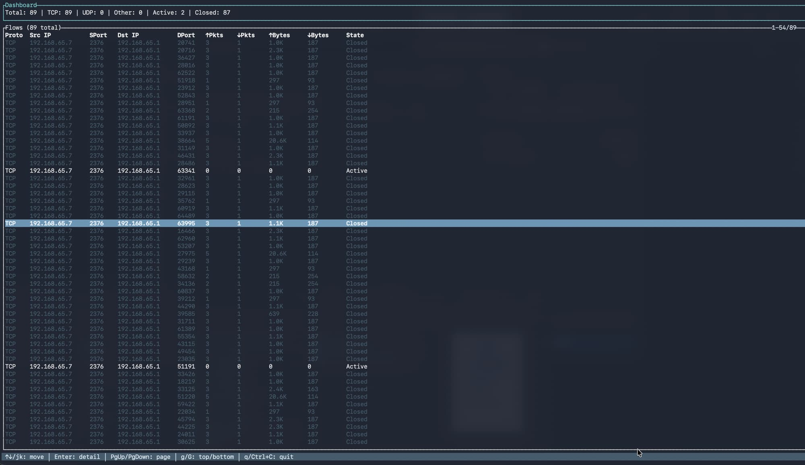

<p align="center">
  
</p>
<h1 align="center">netflow</h1>
<p align="center">A minimal TUI eBPF network traffic explorer.</p>

A terminal network flow monitor built with eBPF and Rust. Think `iftop` meets `bandwhich` — but with flow state tracking, a scrollable TUI, and an HTTP API for pulling live data.

*Current Preview*



```bash
cargo run --release -- --tui
```

## What it does

netflow captures live TCP/UDP traffic from a network interface and tracks each bidirectional flow: packets, bytes, duration, and state (active or closed). 

The TUI gives you a real-time dashboard. Arrow keys or `j`/`k` to move, `Enter` to inspect a flow, `q` to quit. It handles thousands of flows without breaking a sweat.

There's also a lightweight HTTP API on `:8080` (configurable) if you want to pull flow data into your own tooling.

## Quick start

```bash
# 1. Copy the example config and edit the interface
cp netflow.example.toml netflow.toml
# edit netflow.toml → set interface to your NIC (e.g. eth0, en0)
```

And follow the building process

## Building

### Linux (eBPF, recommended)

```bash
# Install system dependencies
sudo apt-get update
sudo apt-get install -y curl git build-essential libpcap-dev libssl-dev pkg-config

# Install Rust (stable + nightly with rust-src)
curl --proto "=https" --tlsv1.2 -sSf https://sh.rustup.rs | sh -s -- -y --default-toolchain none
source "$HOME/.cargo/env"
rustup toolchain install stable --profile minimal
rustup toolchain install nightly --component rust-src --profile minimal
rustup default stable

# Install bpf-linker
cargo install cargo-binstall --locked
cargo binstall bpf-linker --no-confirm --locked

# Build and run
cargo build --release
cargo run --release -- --tui
```

### Linux via Docker

```bash
# 1. Start a persistent dev container
docker run -dit --name netflow-dev --privileged \
  -v "$(pwd):/workspace" -w /workspace \
  -e CARGO_TERM_COLOR=always \
  ubuntu:24.04 bash

# 2. Enter the container
docker exec -it netflow-dev bash

# 3. Inside container: install dependencies
apt-get update && apt-get install -y \
  curl git build-essential ca-certificates \
  libpcap-dev libssl-dev pkg-config

# 4. Install Rust (stable + nightly with rust-src)
curl --proto "=https" --tlsv1.2 -sSf https://sh.rustup.rs | sh -s -- -y --default-toolchain none
source "$HOME/.cargo/env"
rustup toolchain install stable --profile minimal
rustup toolchain install nightly --component rust-src --profile minimal
rustup default stable

# 5. Install bpf-linker
cargo install cargo-binstall --locked
cargo binstall bpf-linker --no-confirm --locked

# 6. Build and run
cargo run --release -- --tui
```

### macOS (libpcap fallback)

```bash
# Install system dependencies
brew install libpcap

# Build and run
cargo build --release
cargo run --release -- --tui
```

## TUI key bindings

- `↑`/`↓` or `j`/`k` — move cursor
- `Enter` — open flow details
- `Esc`/`q` — close details / quit
- `PgUp`/`PgDown` — page through the list
- `g` / `G` — jump to top / bottom
- `Ctrl+C` — quit

Detail panel uses the same navigation keys to scroll long flow info.

## Config

netflow reads `netflow.toml` at startup. Key fields:

- `interface` — NIC to capture on (required)
- `api_bind` — HTTP API listen address
- `udp_timeout_secs` — how long before an idle UDP flow is timed out
- `gc_interval_secs` — how often to clean up closed flows

See `netflow.example.toml` for the full set.

## License

With the exception of eBPF code, this project is dual-licensed under either of
- [MIT license](LICENSE-MIT)
- [Apache License, Version 2.0](LICENSE-APACHE)

at your option.

### eBPF

eBPF code is distributed under either the terms of the
[GNU General Public License, Version 2](LICENSE-GPL2) or the
[MIT license](LICENSE-MIT), at your option.

Unless you explicitly state otherwise, any contribution intentionally submitted
for inclusion in this project by you, as defined in the GPL-2.0 license, shall be
dual licensed as above, without any additional terms or conditions.
